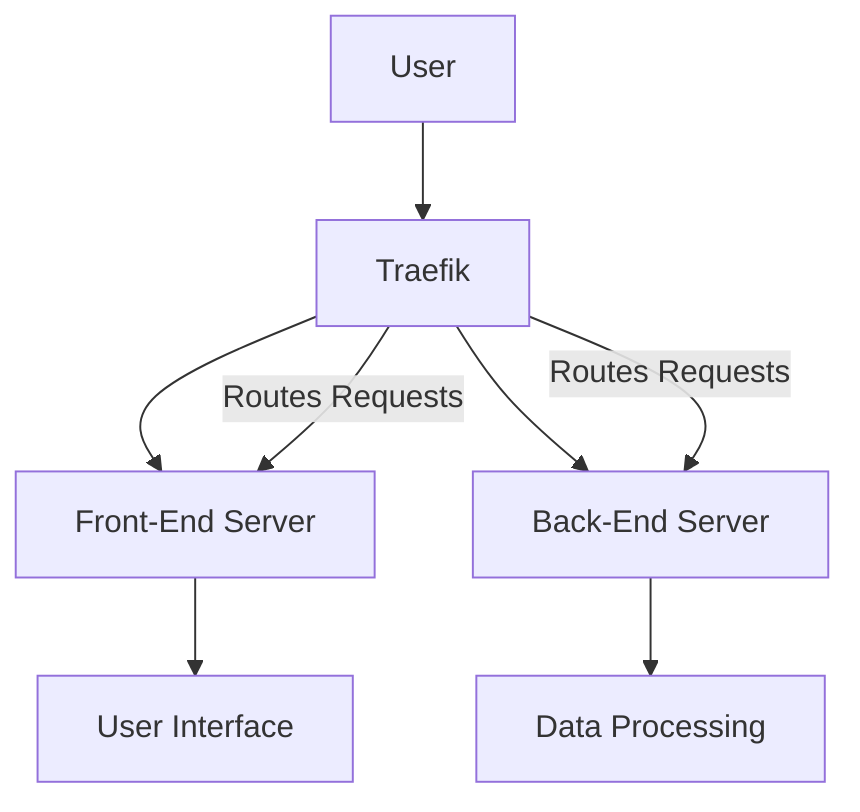

### Explanation:
- **User:** Represents the person interacting with your app.
- **Traefik:** The service that manages and routes requests.
- **Front-End Server:** Handles the user interface and web pages.
- **Back-End Server:** Manages data processing and other server-side operations.
- **User Interface:** The visual part of the app that users interact with.
- **Data Processing:** The backend tasks that process and manage data.

